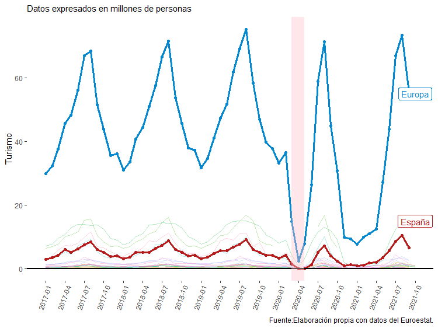
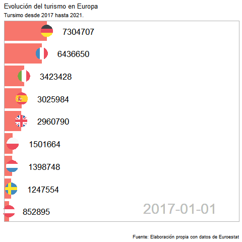
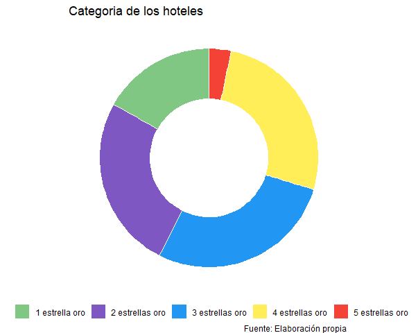
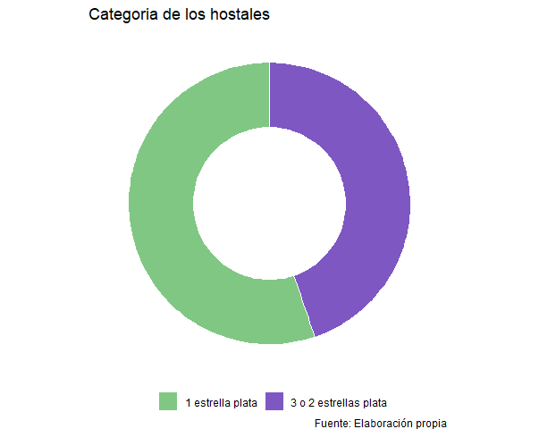
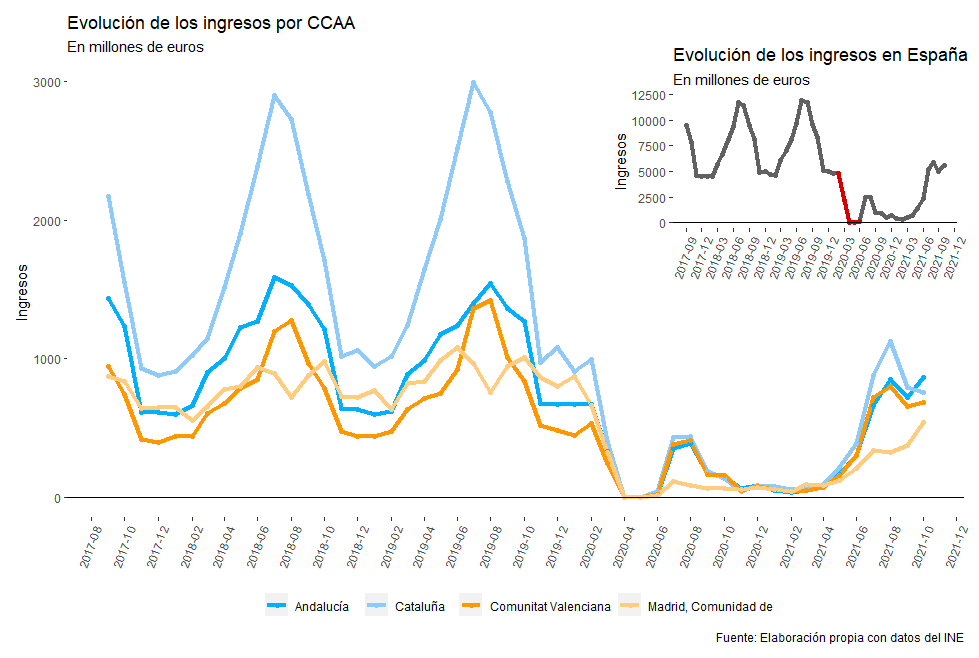

```{r packages-setup, include = FALSE}

library(tidyverse)
library(readr)
library(readxl)
library(rio)
library(ggplot2)
library(plotly)
library(treemap)
library(DT)
library(gt)
library(gganimate)
library(countrycode)
library(ggflags)
pacman::p_load(knitr, here, tidyverse, patchwork, ggrepel)
pacman::p_load(sf, rnaturalearth, rnaturalearthdata)
library(pjpv.datos.01)

```


```{r chunk-setup, include = FALSE}

knitr::opts_chunk$set(echo = TRUE, eval = TRUE, message = FALSE, warning = FALSE, 
                      #results = "hold",
                      cache = FALSE, cache.path = "/caches/", comment = "#>",
                      #fig.width = 7, #fig.height= 7,   
                      #out.width = 7, out.height = 7,
                      collapse = TRUE,  fig.show = "hold",
                      fig.asp = 0.628, out.width = "95%", fig.align = "center")
knitr::opts_chunk$set(dev = "png", dev.args = list(type = "cairo-png"))

```

```{r options-setup, include = FALSE}

options(scipen = 999) #- para quitar la notación científica
options("yaml.eval.expr" = TRUE) 

```


```{r klippy, echo = FALSE}

klippy::klippy(position = c("top", "right")) #- remotes::install_github("rlesur/klippy")

```

<div style="text-align: justify"><div/>

<hr class="linea-black">

<!-- El párrafo de abajo has de dejarlo casi igual, solo HAS de SUSTITUIR "perezp44" por tu usuario de Github-->
Trabajo elaborado para la asignatura "Programación y manejo de datos en la era del Big Data" de la Universitat de València durante el curso 2021-2022. El repo del trabajo está [aquí](https://github.com/fran2200/trabajo_BigData_equipo){target="_blank"}. 

<!-- El párrafo de abajo has de dejarlo exactamente igual, NO has de cambiar nada-->

La página web de la asignatura y los trabajos de mis compañeros pueden verse [aquí](https://perezp44.github.io/intro-ds-21-22-web/07-trabajos.html){target="_blank"}.

<hr class="linea-red">


## 1. Introducción

Para la asignatura de "Programación y manejo de datos en la era del Big Data" he decidido realizar un ensayo sobre como se esta desenvolviendo el **sector turístico**, tanto a nivel nacional, dada su gran relevancia al ser uno de los principlaes motores de la economía española, como internacional.  

**Resumen:** El sector turístico es uno de los principales moteres económicos de cualquier economía, teniendo este una gran repercusión positiva para la misma. No obstante este sector ha sido uno de los principales perjudicados tras la  pandemia de 2020, viviendo durante el periodo de tiempo estudiado en un escenario de incertidumbre caracterizado, por una parte, por por la disminución de sus ingresos desde el inicio de dicho acontecimiento, y por otra, por la imposición de diversas restricciones que han frenado la actividad económica del sector. Y es ahora, momento en el que vivimos un cierto periodo de recuperación económica, cuando nos planteamos en que situación nos encontramos respecto a la situación pre pandemia y como el contexto en el que vivimos puede variar por las nuevas varientes del COVID-19.


**Palabras Clave:** Turismo, Ingresos, Europa, Motor económico, España, Hoteles, Covid-19, Ómicron, Incertidumbre, Recupración, Crisis.

<br>

## 2. Motivaciones

Podemos entender el **turismo** como el conjunto de desplazamientos que realizan los individuos, tanto a un nivel nacional como internacional, de forma voluntaria fuera de su residencia habitual. Dentro de dichos desplazamientos, según las preferencias de los propios turistas, estos se pueden decantar por vivir una serie de experiencias u otras, como pueda ser el turismo de sol y playa (predominante en nuestro país) o uno más enfocado a la cultura o gastronomía. 

No obstante, sea cual sea la elección final del consumidor, todas estas tienen una repercusión positiva para la economía, ya que estimulan tanto la demanda externa como interna generando en el pais perceptor un incremento en los ingresos, tanto a nivel micro como macro, con sus consecuentes efectos positivos sobre el empleo local, la inversión en todo tipo de infraestructuras y el PIB, entre muchos otros efectos. 

En el momento de estar desarrollando este ensayo, el sector turistico a nivel munidal se encuentra en una situación complicada, donde a pesar de la leve recuperación que estabamos viviendo, la nueva variante del Covid-19 (Omicron) a causado un nuevo escenario de incertidumbre que ha provocado la aparición de nuevas restricciones y un incremento en el numero de cancelaciones. Esto lo podemos observar en los tweets siguientes, donde se recoge lo anteriormente comentado


<br>

::: columns
::: {.column width="32%"}


```{r, echo = FALSE, out.width = "60%"}
tweetrmd::tweet_embed("https://twitter.com/mincoturgob/status/1473631907799875587?t=0fZDFkT93eMafgHKTtWAcQ&s=08", theme = "light", align = "center", dnt = TRUE, maxwidth = 400)
```
:::

::: {.column width="1%"}
<!-- an empty Div (with a white space) haciendo de separador -->
:::

::: {.column width="32%"}


```{r, echo = FALSE, out.width = "60%"}
tweetrmd::tweet_embed("https://twitter.com/EPturismo/status/1473382766532202500?t=JV6DdlPE9lb7WqXxXd9Fvw&s=08", theme = "light", align = "center", dnt = TRUE, maxwidth = 400)
```
:::

::: {.column width="1%"}
<!-- an empty Div (with a white space) haciendo de separador -->
:::

::: {.column width="32%"}


```{r, echo = FALSE, out.width = "60%"}
tweetrmd::tweet_embed("https://twitter.com/EPturismo/status/1473942541586341890", theme = "light", align = "center", dnt = TRUE, maxwidth = 400)
```
:::
:::

<br>


La principal **motivación** para la redacción de este articulo ha sido:

  - Observar como han evolucionado a lo largo del tiempo el número de turistas que han obtenido las economías europeas, para realizar una comparacion pre y post crisis sanitaria.
  
  - Analizar como se distribuye parte del sector turístico en España y como han variado los ingresos que este recibe en los últimos años.

<br>

## 3. Datos utilizados{.tabset .tabset-pills}


### Comentarios

Para poder realizar el trabajo, la obtención de toda la información relevante ha sido adquirida en bases de datos como  el INE y Eurostat.

Para poder utilizar estos datos han sido necesario modificarlos antes de adaptarlos a las gráficas deseadas. Este procedimiento lo podemos encontrar dentro del apartado "tidy", donde podemos observar dichas modificaciones.


Además, el apartado "paquetes" podemos encontrar los paquetes necesarios para la elaboración tanto de empleados para la limpieza de datos, como los utilizados para la realización de los diferentes gráficos.


-----------------------


### Tidy 

```{r echo=TRUE, warning=FALSE }

turismo_europa <- read_excel("datos/turismo_europa.xlsx", 
                             col_types = c("text", "numeric", "numeric", "numeric", "numeric", "numeric", 
"numeric", "numeric", "numeric", "numeric", "numeric", "numeric", 
"numeric", "numeric", "numeric", "numeric", "numeric", "numeric", "numeric", "numeric", "numeric", 
"numeric", "numeric", "numeric", 
"numeric", "numeric", "numeric", 
"numeric", "numeric", "numeric", 
"numeric", "numeric", "numeric", 
"numeric", "numeric", "numeric", 
"numeric", "numeric", "numeric", 
"numeric", "numeric", "numeric", 
"numeric", "numeric", "numeric", 
"numeric", "numeric", "numeric", 
"numeric", "numeric", "numeric", 
"numeric", "numeric", "numeric", 
"numeric", "numeric", "numeric", 
"numeric", "numeric"))

turismo_europa <- turismo_europa %>% pivot_longer(cols = 2:59, names_to = "date")

#rio::export(turismo_europa, "./datos/turismo_europa.csv")

turismo_europa <- read_csv("datos/turismo_europa.csv", 
                           col_types = cols(date = col_date(format = "%Y/%m")))

turismo_europa$code <- tolower(countrycode(turismo_europa$Country, origin = 'country.name', destination = 'iso2c'))


```


```{r echo=TRUE, warning=FALSE }

gasto_turistico_esp <- read_excel("datos/gasto_turistico_esp.xls")

gasto_turistico_esp <- gasto_turistico_esp %>% pivot_longer(cols = 2:53, names_to = "date") %>% 
  drop_na()

#rio::export(gasto_turistico_esp, "./datos/gasto_turistico_esp.csv")

gasto_turistico_esp <- read_csv("datos/gasto_turistico_esp.csv", 
    col_types = cols(date = col_date(format = "%Y/%m")))


gasto_comunidades_autonomas <- read_excel("datos/gasto_comunidades_autonomas.xls")

gasto_comunidades_autonomas <- gasto_comunidades_autonomas %>% pivot_longer(cols = 2:51, names_to = "date") %>% 
  arrange(date)

#rio::export(gasto_comunidades_autonomas, "./datos/gasto_comunidades_autonomas.csv")

gasto_comunidades_autonomas <- read_csv("datos/gasto_comunidades_autonomas.csv", 
    col_types = cols(date = col_date(format = "%Y/%m")))

gasto_tur <- full_join(gasto_comunidades_autonomas, gasto_turistico_esp, by = c("location" = "location", "date" = "date", "value" = "value"))

```


```{r echo=TRUE, warning=FALSE }

CCAA <- rio::import("https://github.com/perezp44/archivos_download.2/raw/main/CCAA.rds")

load(here::here("datos", "geometrias_BigData_2021.RData"))

# Para la realización del mapa de España es necesario la descarga de unas geometrías que no han podido ser depositadas en el repositorio por su tamaño superior a 25MB, por ello pongo a vuestra disposición el enlace siguiente el cual nos redirige al paquete de dichas geometrias, https://github.com/rOpenSpain/LAU2boundaries4spain

```

```{r echo=TRUE, warning=FALSE }

n_hoteles <- read_excel("datos/n_hoteles.xlsx")

categorias <- read_excel("datos/categorias.xlsx")

```


-----------------------

### Paquetes

 - library(tidyverse)
 - library(readr)
 - library(readxl)
 - library(rio)
 - library(ggplot2)
 - library(plotly)
 - library(treemap)
 - library(DT)
 - library(gt)
 - library(gganimate)
 - library(countrycode)
 - library(ggflags)
 - options(scipen = 999) 
 - pacman::p_load(knitr, here, tidyverse, patchwork, ggrepel)
 - pacman::p_load(sf, rnaturalearth, rnaturalearthdata)
 - library(pjpv.datos.01)

-----------------------


<br>

## 4 Estudio del turismo en **Europa**

Europa es uno de los principales destinos turísticos a nivel mundial, jugando esta actividad un papel  importante en todas las economías desarrolladas, pero sobre todo en aquellas menos desarrolladas donde este supone un incremento en la ocupación (sobre todo en perosnas jovenes) teniendo una serie de efectos bilateral que benefician a la economía en general. 

Por ello, el Fondo de Desarrollo Regional (FEDER) fomenta la inversión para mejorar la competitividad y sostenibilidad del turismo, beneficiando así a los paises e incentivandolos a innovar y mejorar los servicios ofrecidos.

<br>

### 4.1 Evolución del turismo (2017-2021) 

#### 4.1.1 Tendencia del turismo {.tabset .tabset-pills}

##### Tendencia 

En primer lugar, podemos observar como ha evolucionado la llegada de turistas a los diferentes paises europeos, haciendo incapie en el computo global que recibe **Europa** y remarcando la contribución de **España** en ello.

```{r echo=TRUE, warning=FALSE }
p1a <- turismo_europa %>% filter(Country %in% c("European_Union"))
p1b <- turismo_europa %>% filter(Country %in% c("Spain"))
p1 <- turismo_europa 

p <- ggplot() +
  geom_line(data = p1, aes(date, value/10^6, colour = Country), alpha = 0.3) +
  geom_line(data = p1a, aes(date, value/10^6), color = "#0288d1", size = 1.2) +
  geom_point(data = p1a, aes(date, value/10^6), color = "#0288d1", size = 1.5) +
  geom_line(data = p1b, aes(date, value/10^6), color = "#b71c1c", size = 1.2) +
  geom_point(data = p1b, aes(date, value/10^6), color = "#b71c1c", size = 1.5) +
  geom_hline(yintercept = 0,
             size = 1,
             colour = "black") +
  scale_x_date(date_labels="%Y-%m",date_breaks  ="3 months")+
  
  annotate("rect",
           xmin = as.Date("2020-03-01"),
           xmax = as.Date("2020-05-01"),
           ymin = -Inf,
           ymax = Inf,
           alpha = 0.4,
           fill = "pink") +
  annotate(geom = "label",
           x= as.Date("2021-10-01"),
           y = 55,
           label = "Europa",
           size = 4,
           color = "#0288d1")  +
  annotate(geom = "label",
           x= as.Date("2021-10-01"),
           y = 15,
           label = "España",
           size = 4,
           color = "#b71c1c")  +
  
  theme(axis.text.x = element_text(angle = 70, hjust = 1)) + 
  theme(plot.title = element_text(family = "serif"),
    panel.background = element_rect(fill = "white"),
    plot.background = element_rect(fill = "white"),
    legend.position = "none") +labs(x = NULL, y = "Turismo", subtitle = "Datos expresados en millones de personas ",
    caption = "Fuente:Elaboración propia con datos del Euroestat.")
  

```

<center></center>

<br>

Como podemos observar en el gráfico, la llegada de turistas presenta una fuerte **temporalidad**, teniendo su pico más elevado en los meses de julio y agosto. Esto debido al desplazamineto de la población hacia paises como España o Italia que en este época del año se caracterizan por su buen clima y gran oferta de turismo de sol y playa.

Otro dato a destacar es que en la época **pre-pandemia** el máximo de cada año superaba al del anterior, tendencia que se rompe tras la gran caida que hubo en marzo de 2020, a causa del COVID-19 y las travas que supuso para el desplazamiento de la población ( confinamientos, imposibilidad de viajar...), hecho que a marcado un antes y despues, ya que, además de que la temporalidad se ha incrementado y prolongado en el tiempo, aun no hemos recuperado los niveles previos a la crisis sanitaria, aunque se puede observar como estamos camino a lograrlo ya que el pico de este año supera al predecesor. 

Para más detalle de como han evolucionado todas las economías puede consultar la **tabla**.


-----------------------


<br>


##### Tabla 

```{r, echo = TRUE, warning= FALSE}
  
datatable(turismo_europa, class ="stripe hover compact row-border" , filter = 'top')

```
-----------------------

<br>

#### 4.1.2 ¿Que paises reciben un mayor número de turistas? {.tabset .tabset-pills}

##### Julio

Como he mencionado en el apartado anterior, los meses donde hay mayor afluencia de turistas son **julio** y **agosto**, por ello en los graficos siguintes vamos a observar que paises recibieron un mayor número de visitantes en dichos meses en el periodo **2017-2020** (ver pestaña **agosto**). 

```{r echo=TRUE, warning=FALSE }
turismo_barras1 <- turismo_europa %>% 
  filter(Country != "European_Union") %>% 
  group_by(date) %>% 
  arrange(date, desc(value)) %>% 
  mutate(ranking = row_number()) %>%
  filter(ranking <=5) %>% 
  ungroup() %>% 
  filter(date == "2017-07-01" | date == "2018-07-01" | date == "2019-07-01" | date == "2020-07-01")


a11 <- ggplot(turismo_barras1, aes(ranking, value), size = 20) +
  geom_col(aes(ranking, value, fill = Country)) +
  scale_fill_brewer(palette = "Set3") +
  scale_x_reverse() +
  coord_flip(clip = "off", expand = FALSE) +
  theme_light() +
  facet_wrap(
    vars(date), nrow = 2, ncol = 2) + 
  
  theme(axis.text.x = element_text(colour = "white"),
    plot.background = element_rect(fill = "white")) +
  labs(y = "Turismo", subtitle = "Máximo turismo en agosto ",
    caption = "Fuente: Elaboración propia con datos del Euroestat ") +
  theme(panel.background = element_rect(colour = "white")) + 
  theme(panel.background = element_rect(linetype = "solid")) 

a11 <- ggplotly(a11)

a11

```

Una vez vistas ambas pestañas, podemos concluir con que los paises con una mayor afluencia turística son **Francia**, **Alemania**, **Reino Unido**, **Italia** y **España**, estando estos simepre en el top 5 de economías estudiadas manteniendo en la mayoria de casos su posición en este top.

Un factor a destacar, es que a pesar de ser las referentes en el ambito turístico europeo, todas ellas vieron disminuir en cierta medida el numero de turistas recibido en 2020, hecho que concuerda con la conclusion del computo global de Europa del primer apartado.

----------------------- 

<br>


##### Agosto 

```{r echo=TRUE, warning=FALSE }
turismo_barras <- turismo_europa %>% 
  filter(Country != "European_Union") %>% 
  group_by(date) %>% 
  arrange(date, desc(value)) %>% 
  mutate(ranking = row_number()) %>%
  filter(ranking <=5) %>% 
  ungroup() %>% 
  filter(date == "2017-08-01" | date == "2018-08-01" | date == "2019-08-01" | date == "2020-08-01")


a1 <- ggplot(turismo_barras, aes(ranking, value), size = 20) +
  geom_col(aes(ranking, value, fill = Country)) +
  scale_fill_brewer(palette = "Set3") +
  scale_x_reverse() +
  coord_flip(clip = "off", expand = FALSE) +
  theme_light() +
  facet_wrap(
    vars(date), nrow = 2, ncol = 2) + 
  
  theme(axis.text.x = element_text(colour = "white"),
    plot.background = element_rect(fill = "white")) +
  labs(y = "Turismo", subtitle = "Máximo turismo en agosto ",
    caption = "Fuente: Elaboración propia con datos del Euroestat ") +
  theme(panel.background = element_rect(colour = "white")) + 
  theme(panel.background = element_rect(linetype = "solid")) +
  theme(legend.position = "none")

a1 <- ggplotly(a1)

a1

```
----------------------- 

#### 4.1.3 ¿A quien le afecto más la crisis sanitaria? {.tabset .tabset-pills}

##### Cuadros 

En estos dos cuadros podemos observar como a la economía de Slovenia no le afecto de forma significativamente negativa la crisis sanitaria, sino todo lo contrario, ya que el nivel de turismo respecto al mes de agosto del año anterior se vió incremenetado. 

Sin emabargo, el pais mas afectado fue Liechtenstein, donde el turismo en agosto disminuyó en un 50% respecto al año de anterior. 

Si se desea saber como evolucionó cada economía lo puede observar en la **tabla**.

::: {.column width="47%"}

```{r}


impacto <- turismo_europa %>% filter(date == "2019-08-01" | date == "2020-08-01")

impacto <- impacto %>% filter(Country != "European_Union") %>% 
  group_by(Country) %>% 
  mutate(crecimiento = value - lag(value)) %>% 
  mutate(incremento = crecimiento / first(value) * 100 ) %>% 
  ungroup()

max <- impacto %>% slice_max(incremento, n = 1) %>% 
  select(Country, incremento)

min <- impacto %>% slice_min(incremento, n = 1) %>% 
  select(Country, incremento)
  
  
  
bandera_max <- c("http://banderasmundo.es/banderas/eslovenia.png")


max_inc <- max %>% group_by(Country) %>% 
  add_column(bandera_max) %>% ungroup()


Tabla_max <- max_inc %>% gt()

Tabla_max <- Tabla_max %>%
  tab_header(title = md("**País menos perjudicado**"),subtitle = md("A fecha: 01-08-2020"))

Tabla_max <- Tabla_max %>%
  tab_options(heading.background.color = "#ffb74d") %>% tab_options(heading.title.font.size = 15, heading.subtitle.font.size = 13,  column_labels.font.weight =  "bold")


Tabla_max <- Tabla_max  %>%
  gt::text_transform(locations = cells_body(columns = vars(bandera_max)), fn = function(x) {gt::web_image(x, height = 50)}) %>%  cols_align(
    align = "center")

Tabla_max

```

:::

::: {.column width="1%"}
<!-- an empty Div (with a white space) haciendo de separador -->
:::

::: {.column width="47%"}


```{r}

bandera_min <- c("http://banderasmundo.es/banderas/liechtenstein.png")


min_inc <-min %>% group_by(Country) %>% 
  add_column(bandera_min) %>% ungroup()


Tabla_min <- min_inc %>% gt()

Tabla_min <- Tabla_min %>%
  tab_header(title = md("**Pais más perjudicado**"),subtitle = md("A fecha: 01-08-2020"))

Tabla_min <- Tabla_min %>%
  tab_options(heading.background.color = "#ffb74d") %>% tab_options(heading.title.font.size = 15, heading.subtitle.font.size = 13,  column_labels.font.weight =  "bold")


Tabla_min <- Tabla_min  %>%
  gt::text_transform(locations = cells_body(columns = vars(bandera_min)), fn = function(x) {gt::web_image(x, height = 50)}) %>%  cols_align(
    align = "center")

Tabla_min

```

:::

-----------------------


##### Tabla

```{r echo=TRUE, warning=FALSE }

impacto_tabla <- impacto %>% select(Country, date, incremento) %>% 
  drop_na()

datatable(impacto_tabla, class ="stripe hover compact row-border" , filter = 'top')

```

-----------------------

### 4.2 Imortancia de cada país en la actualidad 

#### 4.2.1 Treemap

A traves de este treemap podemos concluir lo que deciamos ya en apartados anteriores, los paises con una mayor numero de turistas en Agosto de 2021 siguen siendo Alemania, Iatlia y España. 
Este hecho no sorprende ya que es una continuación de la **tendencia** anteriormente descrita, sin embargo cabe destacar que el número de personas que decidieron desplazarse este año ha superado al predecesor, como se puede observar tanto en el gráfico como en la tabla del primer apartado, siendo esto consecuencia de la mejora de la crisis sanitaria por el gran avance en la vacunación contra el covid, que ha permitido la eliminación de numerosas restricciones.

*El hecho de que no aparezcan paises como Francia y Reino Unido se debe a la falta de datos en el Eurostat de estos paises para el perido estudiado de 2021.*

```{r echo=TRUE, warning=FALSE }
p2 <- turismo_europa %>% filter(date == "2021-08-01") %>% 
  filter(Country != "European_Union") %>% 
  slice_max(value, n =15)
  


p2 <- treemap(p2,
              index="Country",
              vSize="value",
              type="index",
              title="Turismo en la UE (Agosto 2021)",
              palette="Set3",
              border.col=c("white"), 
              border.lwds=3, 
              fontface.labels=1,
              bg.labels=c("transparent"),              
              align.labels=c("center", "center"),                                  
                              overlap.labels=0.5)


```

<br>


#### 4.2.2 Gráfico de barras 

Aquí podemos observar lo anteriormente descrito, las principales economías suelen ser siempre las mismas, presentando por una parte todas la misma temporalidad (reflejada en la disminución del numero de turistas en los mismos meses) y por otra, la disminución de turistas por el COVID-19. 

```{r echo=TRUE, warning=FALSE }

barras <- turismo_europa %>% 
  filter( Country != "European_Union")

barras  <- barras  %>% 
  group_by(date) %>% 
  arrange(date, desc(value)) %>% 
  mutate(ranking = row_number()) %>%
  filter(ranking <=9) %>% 
  ungroup() 

barras$date <- as.character(barras$date)


tabla_1 <- ggplot(barras, aes(ranking, value, country = code, size = 15)) +
  geom_col(aes(ranking, value,  fill = "#ffb74d")) +
  
  geom_flag(aes(ranking, value, country = code), size = 10) +
  geom_text(aes(ranking, value, label = as.factor(value), size = 20), hjust= -0.5) +
  geom_text(aes(x=9, y=30000000, label = as.factor(date)), vjust = 0.2, alpha = 0.5,  col = "gray", size = 10) +
  
  scale_x_reverse() +
  coord_flip(clip = "off", expand = FALSE) +
  theme_light() +
  theme(
    panel.grid = element_blank(), 
    legend.position = "none",
    axis.ticks.y = element_blank(),
    axis.title.y = element_blank(),
    axis.text.y = element_blank()) +
    theme(axis.line = element_line(colour = NA),
                              axis.ticks = element_line(colour = NA),
                              panel.grid.major = element_line(colour = NA),
                              panel.grid.minor = element_line(colour = NA),
                              axis.text = element_text(colour = NA),
                              plot.background = element_rect(colour = NA)) +labs(x = NULL, y = NULL)+
  labs(title = "Evolución del turismo en Europa",
       subtitle = "Tursimo desde 2017 hasta 2021.",
       caption = "Fuente: Elaboración propia con datos de Euroestat") +
  lims(y = c(NA, 40000000)) +
  
  transition_states(as.factor(date),transition_length = 1, state_length = 0, wrap = FALSE)

tabla_1 <- tabla_1 +  theme(legend.position = "none") 

#gganimate::animate(tabla_1, nframes = 450, fps = 25) 

```

<center></center>

<br>


## 5 Estudio del turismo en **España** 

El turismo es uno de los principales motores de la economía española, otorgando empleo aproximadamnete a 2 millones de personas, con los que se recibe de promedio a 80 millones de turistas al año (antes de la pamdemia) que dejan aproximadamnete unos 90.000 millones de euros en ingresos. Por ello, no es de extrañar la elevada inversión llevada a cabo para mejorar el sector.

Todas estas inversiones han derivado en que España se convierta en uno de los paises más competitivos en el sector turístico, quedando esto demostrado en el ranking elaborado por el Worl Economic Forum, otorgandole la primera posición de entre 140 economías.

Esto es posible por la gran oferta turistica de la que dispone nuestro país, pudiendo decantarse por experiencias más enfocadas en el sol y playa o más cultrales y naturales, hospedandose en la gran densidad hotelera instalada en nuetsro país.

<br>

### 5.1 Estudio de la oferta hotelera

#### 5.1.2 Número de hoteles por CCAA

En este gráfico podemos observar el numero de establecimientos hoteleros por comunidad autonoma, siendo Andalucia la comunidad con mayor presencia de estos con 1557 establecimientos, seguido de comunidades como Cataluña, Madrid o Valencia, que como veremos en el apartado 5.2 son las comunidades que mayor número de turistas, y por ende ingresos, reciben.

Algo que puede sorprender es el hecho del número de hoteles de los que disponen las islas baleares y canarias, hecho que se explica por su reducida dimensión, y el hecho de que comunidades como Galicia y Castilla y Leon, que a priori no están consideradas como comunidades que reciban un numero considerable de turistas, posean un mayor número de hoteles que la Comunitat Valenciana y la Comunidad de Madrid.

```{r echo=TRUE, warning=FALSE }

num <- ggplot() +
  geom_col(data = n_hoteles, aes( x = reorder(location, n_hoteles), y = n_hoteles, fill = n_hoteles)) +
   scale_fill_continuous(low="#ffecb3", high="#ff8f00") +
  
  coord_flip() +
  
  theme(panel.background = element_rect(fill = "white"),
    plot.background = element_rect(fill = "white")) +
  labs(x = NULL, y = NULL, fill = "Hoteles",
    caption = "Fuente: Elaboración propia ") + 
  theme(legend.position = "none")

num <- ggplotly(num)

num

```

<br>


#### 5.1.2 Categoría de dichos hoteles {.tabset .tabset-pills}

##### Gráfico de Dona

Dichos **hoteles** están clasificados segun una clasificación de **estrellas oro**, de 1 a 5 estrellas, siendo la quinta la de mayor prestigio (aunque esta regulación cambia de comuindad en comunidad por lo que no se siguen los mismos criterios para cada decisión).

Como podemos observar en el gráfico de Dona, los hoteles de 2,3 y 4 estrellas represnetan una mayor proporcion en España. 

Además también disponemos de la información sobre los **hostales**, que al igual que los hoteles se clasifican con estrellas, pero esta vez de **plata**. En este caso observamos como los hotales de una estrella son los principales en nuestro pais. 

Si desea conocer los porcentajes con detalle puede acudir a la **tabla**

::: {.column width="47%"}

```{r echo=TRUE, warning=FALSE }

categoria_hotel <- categorias %>% filter( categoria == "hoteles") %>% 
  mutate(total = sum(numero)) %>% 
  mutate(porcentaje = (numero / total) * 100) 

n <- ggplot(categoria_hotel ,aes(x=2,y=porcentaje, fill = estrellas))+
  geom_bar(stat = "identity",
           color="white")+
  
  scale_fill_manual(values=c("#81c784","#7e57c2","#2196f3","#ffee58", "#f44336")) +
  
  coord_polar(theta = "y")+
  xlim(0.5,2.5)  +
  theme_void()+
  
  theme(axis.line = element_line(colour = "white"),
    axis.ticks = element_line(colour = "white"),
    panel.background = element_rect(fill = "white"),
    plot.background = element_rect(fill = "white"),
    legend.position = "none") +
    labs(x = NULL, y = NULL, fill = NULL)+labs(title = "Categoria de los hoteles",
    caption = "Fuente: Elaboración propia ") + 
  theme(panel.grid.major = element_line(colour = "white"),
        panel.grid.minor = element_line(colour = "white"),
        panel.background = element_rect(colour = "white")) + 
  theme(legend.position = "bottom", legend.direction = "horizontal") + 
  theme(panel.grid.major = element_line(colour = NA),
        panel.grid.minor = element_line(colour = NA),
        axis.title = element_text(colour = "white"),
        panel.background = element_rect(colour = NA),
        plot.background = element_rect(colour = NA))

#n
 
  

```

<center></center>


:::

::: {.column width="1%"}
<!-- an empty Div (with a white space) haciendo de separador -->
:::

::: {.column width="47%"}


```{r echo=TRUE, warning=FALSE }

categoria_hostal <- categorias %>% filter( categoria == "hostales") %>% 
  mutate(total = sum(numero)) %>% 
  mutate( porcentaje = (numero / total) * 100)


m <- ggplot(categoria_hostal ,aes(x=2,y=porcentaje, fill = estrellas))+
  geom_bar(stat = "identity",
           color="white")+
  
  scale_fill_manual(values=c("#81c784","#7e57c2","#2196f3","#ffee58", "#f44336")) +
  
  coord_polar(theta = "y")+
  xlim(0.5,2.5)  +
  theme_void()+
  
  theme(axis.line = element_line(colour = "white"),
        axis.ticks = element_line(colour = "white"),
        panel.background = element_rect(fill = "white"),
        plot.background = element_rect(fill = "white"),
        legend.position = "none") +
  labs(x = NULL, y = NULL, fill = NULL)+labs(title = "Categoria de los hostales",
                                             caption = "Fuente: Elaboración propia ") + 
  theme(panel.grid.major = element_line(colour = "white"),
        panel.grid.minor = element_line(colour = "white"),
        panel.background = element_rect(colour = "white")) + 
  theme(legend.position = "bottom", legend.direction = "horizontal") + 
  theme(panel.grid.major = element_line(colour = NA),
    panel.grid.minor = element_line(colour = NA),
    axis.title = element_text(colour = "white"),
    panel.background = element_rect(colour = NA),
    plot.background = element_rect(colour = NA))


#m


```

<center></center>


:::

-----------------------


##### Tablas

```{r, echo = TRUE, warning= FALSE}
  
datatable(categoria_hotel, class ="stripe hover compact row-border" , filter = 'top')

```

```{r, echo = TRUE, warning= FALSE}

datatable(categoria_hostal, class ="stripe hover compact row-border" , filter = 'top')

```
-----------------------

### 5.2 Estudio de los ingresos por turismo

#### 5.2.1 Evolución de los ingresos

El sector turístico supone una fuente de ingresos muy grande para España, de unos 90.000 millones de euros al año como he comentado anteiormente, no obstante desde la crisis vivida en 2020 los ingresos decayeron de manera muy considerable, y a pesar de que vivimos en un periodo de cierta recuperación, tanto económica como de libertad de movimiento, los ingresos del año 2021 distan mucho de ser semblantes a los de años anteriores.

```{r echo=TRUE, warning=FALSE }

# Gráfico de España

gasto_esp <- gasto_tur %>% filter(location == "Spain")

gasto_esp$date <- as.Date(gasto_esp$date)

gasto_esp_2 <- gasto_esp %>% filter(date == "2020-02-01" | date == "2020-03-01" | date == "2020-04-01" | date == "2020-05-01" | date == "2020-06-01")

m1 <- ggplot() +
  geom_line(data = gasto_esp, aes(date, value), color = "#616161", size = 1.5) +
  geom_point(data = gasto_esp, aes(date, value ), color = "#616161", size = 1.5) +
  
  geom_line(data = gasto_esp_2, aes(date, value), color = "#d50000", size = 1.5) +
  geom_point(data = gasto_esp_2, aes(date, value), color = "#d50000", size = 1.5) +
  
  
  geom_hline(yintercept =0,
             size = 0.25,
             colour = "black") +
  
  
  scale_x_date(date_labels="%Y-%m",date_breaks  ="3 months") +
  theme(axis.text.x = element_text(angle = 70, hjust = 1)) +
  
  theme(panel.background = element_rect(fill = "white"),
    plot.background = element_rect(fill = "white")) +
  
  labs(title = "Evolución de los ingresos en España",
    x = NULL, y = "Ingresos", subtitle = "En millones de euros")


# Gráfico de las comunidades 

gasto_comu <- gasto_tur %>%  filter(location != "Spain") %>% 
  filter(location %in% c("Andalucía", "Cataluña", "Comunitat Valenciana", "Madrid, Comunidad de"))

m2 <- ggplot() +
  geom_line(data = gasto_comu, aes(date, value, color = location), size = 1.5) +
  geom_point(data = gasto_comu, aes(date, value, color = location), size = 1.5) +
  
  geom_hline(yintercept =0,
            size = 0.25,
            colour = "black") +
  
  
  scale_x_date(date_labels="%Y-%m",date_breaks  ="2 months") +
  
  
  theme(axis.text.x = element_text(angle = 70, hjust = 1))  + 
  
  
  scale_color_manual(breaks = c("Andalucía", "Cataluña", "Comunitat Valenciana", "Madrid, Comunidad de"),
                     values=c("#00b0ff", "#90caf9", "#ff9800", "#ffcc80")) +
  
  
  theme(panel.background = element_rect(fill = "white"),
    plot.background = element_rect(fill = "white"),
    legend.position = "bottom", legend.direction = "horizontal") +
  
  labs(title = "Evolución de los ingresos por CCAA",
    x = NULL, y = "Ingresos ", colour = NULL,
    subtitle = "En millones de euros ", caption = "Fuente: Elaboración propia con datos del INE")


#m2 + inset_element(m1, left = 0.6, right = 1, bottom = 0.5, top = 1.05)
  

```

<center></center>


<br>


### 5.3 Principales Comunidades Aurónomas

#### 5.3.1 Comunidades Autónomas con más ingresos {.tabset .tabset-pills}

##### Mapa

En este apartado podemos apreciar como las CCAA con mayor nivel de ingresos por turismo son Cataluña, Andalucía, Comunitat Valenciana, Comunidad de Madrid, Illes Balears y Canarias.

Si desea conocer los ingresos en cada perido puede consultar la **tabla**

```{r echo=TRUE, warning=FALSE }

rm(gasto_comunidades_autonomas, gasto_turistico_esp, IGN_nomencla_muni, municipios_2020, rio_ebro_4, rios_espanya, world)

CCAA_2 <- Provincias %>% group_by(ine_ccaa, ine_ccaa.n) %>% summarize()

CCAA_3 <- CCAA_2 %>% sf::st_drop_geometry()


#unir aqui los datos del gasto con su geometría

canarias <- CCAA_2 %>% filter(ine_ccaa.n == "Canarias")
peninsula <- CCAA_2 %>% filter( !(ine_ccaa.n == "Canarias"))

my_shift <- st_bbox(peninsula)[c(1,2)]- (st_bbox(canarias)[c(1,2)]) + c(-2.4, -1.1)
canarias$geometry <- canarias$geometry + my_shift
st_crs(canarias)  <- st_crs(peninsula)
peninsula_y_canarias <- rbind(peninsula, canarias)

peninsula_y_canarias_1 <-peninsula_y_canarias %>% sf::st_drop_geometry()

gasto_ccaa <- full_join(gasto_tur, peninsula_y_canarias, by = c("location" = "ine_ccaa.n"))

gasto_ccaa <- gasto_ccaa %>% filter(date == "2021-08-01")

p1 <- ggplot() +
   geom_sf(data = peninsula_y_canarias) +
  geom_sf(data = gasto_ccaa, aes(geometry = geometry, fill = value )) +
  theme_void()  +
  theme(plot.subtitle = element_text(family = "serif", face = "italic"),
        plot.title = element_text(family = "serif", face =  "italic")) +
  labs(title = "Gasto turístico", fill = "Ingresos")  +
  scale_fill_continuous(low="#ffecb3",high="#ef6c00") +
  labs(title = "",
       caption = "Datos extraidos de INE")

p1

```

-----------------------

<br>


##### Tabla 

```{r echo=TRUE, warning=FALSE }

gasto_tur_2 <- gasto_tur %>% rename(ingresos = value)

datatable(gasto_tur_2, class ="stripe hover compact row-border" , filter = 'top')

```

-----------------------


#### 5.3.2 Consecuencias del Covid-19 {.tabset .tabset-pills}

##### Impacto 

En estos cuadros podemos observar cuales fueron las comunidades, de las anteriormente mencionadas, que sufrieron en mayor y menor medida las consecuenicas del COVID-19.

::: {.column width="47%"}

```{r echo=TRUE, warning=FALSE }

impacto_2 <- gasto_tur %>% filter(date == "2019-08-01" | date == "2020-08-01")

impacto_2 <- impacto_2 %>% filter(location != c("Spain", "Otras Comunidades Autónomas")) %>% 
  group_by(location) %>% 
  mutate(crecimiento = value - lag(value)) %>% 
  mutate(incremento = crecimiento / first(value) * 100 ) %>% 
  ungroup()

max_2 <- impacto_2 %>% slice_max(incremento, n = 1) %>% 
  select(location, incremento)


bandera_valencia <- ("imagenes/comunidad_valenciana.png")


max_inc <- max_2 %>% group_by(location) %>% 
  add_column(bandera_valencia) %>% 
  ungroup()


Tabla_max_b <- max_inc %>% gt()

Tabla_max_b <- Tabla_max_b %>%
  tab_header(title = md("**Comunidad menos perjudicada**"),subtitle = md("A fecha: 01-08-2020"))

Tabla_max_b <- Tabla_max_b %>%
  tab_options(heading.background.color = "#ffb74d") %>% 
  tab_options(heading.title.font.size = 15, heading.subtitle.font.size = 13,  column_labels.font.weight =  "bold")


Tabla_max_b <- Tabla_max_b  %>%
  gt::text_transform(locations = cells_body(columns = vars(bandera_valencia)), fn = function(x) {gt::web_image(x, height = 50)}) %>%  
  cols_align(
    align = "center")

Tabla_max_b

```

:::

::: {.column width="1%"}
<!-- an empty Div (with a white space) haciendo de separador -->
:::

::: {.column width="47%"}


```{r echo=TRUE, warning=FALSE }

min_2 <- impacto_2 %>% slice_min(incremento, n = 1) %>% 
  select(location, incremento)

bandera_madrid <- ("imagenes/madrid.png")


min_inc <- min_2 %>% group_by(location) %>% 
  add_column(bandera_madrid) %>% ungroup()


Tabla_mix_b <- min_inc %>% gt()

Tabla_mix_b <- Tabla_mix_b %>%
  tab_header(title = md("**Comunidad más perjudicada**"),subtitle = md("A fecha: 01-08-2020"))

Tabla_mix_b <- Tabla_mix_b %>%
  tab_options(heading.background.color = "#ffb74d") %>% tab_options(heading.title.font.size = 15, heading.subtitle.font.size = 13,  column_labels.font.weight =  "bold")


Tabla_mix_b <- Tabla_mix_b  %>%
  gt::text_transform(locations = cells_body(columns = vars(bandera_madrid)), fn = function(x) {gt::web_image(x, height = 50)}) %>%  cols_align(
    align = "center")

Tabla_mix_b

```

:::

-----------------------


##### Recuperación

Aquí vemos como los papeles se invierte, y la comunidad que más cayó en 2020 es la que mayor recuperación presenta en 2021 y viceversa. 

::: {.column width="47%"}


```{r}

recu <-  gasto_tur %>% filter(date == "2020-08-01" | date == "2021-08-01")

recu <- recu %>% filter(location != c("Spain", "Otras Comunidades Autónomas")) %>% 
  group_by(location) %>% 
  mutate(crecimiento = value - lag(value)) %>% 
  mutate(incremento = crecimiento / first(value) * 100 ) %>% 
  ungroup()

recu_max <- recu %>% slice_max(incremento, n = 1) %>% 
  select(location, incremento)

bandera_madrid <- ("imagenes/madrid.png")

recu_1 <- recu_max %>% group_by(location) %>% 
  add_column(bandera_madrid) %>% ungroup()


Tabla_max_c <- recu_1 %>% gt()

Tabla_max_c <- Tabla_max_c %>%
  tab_header(title = md("**Comunidad con una mayor recuperación**"),subtitle = md("A fecha: 01-08-2021"))

Tabla_max_c <- Tabla_max_c %>%
  tab_options(heading.background.color = "#ffb74d") %>% tab_options(heading.title.font.size = 15, heading.subtitle.font.size = 13,  column_labels.font.weight =  "bold")


Tabla_max_c <- Tabla_max_c  %>%
  gt::text_transform(locations = cells_body(columns = vars(bandera_madrid)), fn = function(x) {gt::web_image(x, height = 50)}) %>%  cols_align(
    align = "center")

Tabla_max_c


```

:::

::: {.column width="1%"}
<!-- an empty Div (with a white space) haciendo de separador -->
:::

::: {.column width="47%"}


```{r}

recu_min <- recu %>% slice_min(incremento, n = 1) %>% 
  select(location, incremento)

bandera_valencia <- ("imagenes/comunidad_valenciana.png")

recu_2 <- recu_min %>% group_by(location) %>% 
  add_column(bandera_valencia ) %>% ungroup()


Tabla_min_c <- recu_2 %>% gt()

Tabla_min_c <- Tabla_min_c %>%
  tab_header(title = md("**Comunidad con una menor recuperación**"),subtitle = md("A fecha: 01-08-2021"))

Tabla_min_c <- Tabla_min_c %>%
  tab_options(heading.background.color = "#ffb74d") %>% tab_options(heading.title.font.size = 15, heading.subtitle.font.size = 13,  column_labels.font.weight =  "bold")


Tabla_min_c <- Tabla_min_c  %>%
  gt::text_transform(locations = cells_body(columns = vars(bandera_valencia)), fn = function(x) {gt::web_image(x, height = 50)}) %>%  cols_align(
    align = "center")

Tabla_min_c


```

:::


-----------------------


## 6 Conclusiones 

Para finalizar el trabajo destacar como el turismo es uno de los principales motores de las economías europeas, sobre todo de la española, proporcionando esta una fuente de ingresos muy importante, con lo que todo ello conlleva (empleo, bienestar, PIB...). Por ello es preocupnate la situación actual en la que vivimos, ya que a pesar de que en la actualidad experimentamos una cierta recuperación económica, están surgiendo nuevas variantes del COVId-19, como la Omicron, que están poniendo en jaque a las econmias mencionadas en el trabajo, por lo cual no se descarta la imposición de nuevas restricciones que puedan refrenar dicha recuperación afectando así de forma muy negativa a este sector en concreto.


<br>


Respecto a la elaboración del trabajo, destacar como la elaboración del ensayo grupal me ha servido de utilidad en el momento de tratar de manejar los datos, así como para la elaboración de gráficas que antes suponian un plus de dificultad. Además, la realización de este me ha permitido acabar de asentar los conociminetos adquiridos tanto en la asignatura como los que adquirimos junto a mis compañeros y yo al realizar el otro trabajo.


<br>


## 7. Referencias

Para realizar los comentarios y gráficos que hemos ido analizando a lo largo del trabajo me he basado en artículos y datos que expondré a continuación .

Para poder realizar dichos comentarios, he consultado estos artículos:

- <a href="https://conceptodefinicion.de/turismo/">https://conceptodefinicion.de/turismo/</a>

- <a href="https://www.investinspain.org/es/sectores/turismo-ocio">https://www.investinspain.org/es/sectores/turismo-ocio</a>

- <a href="https://tecnohotelnews.com/2017/07/17/el-sector-turistico-principal-motor-de-la-economia-espanola/">https://tecnohotelnews.com/2017/07/17/el-sector-turistico-principal-motor-de-la-economia-espanola/</a>

- <a href="https://ec.europa.eu/regional_policy/es/policy/themes/tourism/">https://ec.europa.eu/regional_policy/es/policy/themes/tourism/

Para realizar gráficos [animados](https://gganimate.com/), he consultado las explicaciones de como implementar el paquete gganimate en el proyecto.

Para poder realizar un mapa de España y sus [CCAA](https://perezp44.github.io/intro-ds-21-22-web/tutoriales/tt_09_GIS-con-R.html#Datos_espaciales) me he basado en este tutorial de la asignatura. 

Además, para la poder determinar de forma muy visual la proporción de turistas por pais he elaborado un treemap bansadome en esta [página](https://www.r-graph-gallery.com/treemap.html").

También he consulatdo la página [R-Graph](https://www.r-graph-gallery.com/) como inspiración para algunos gráficos.

Para determinar la escala de colores, tanto del CSS como de los gráficos he consultado estas [paletas](https://www.materialpalette.com/colors)

Por último, destacar que tambíen he consultado los trabajos realizados por mis compañeros en años anteriores. Los puedes encontrar  [aqui](https://perezp44.github.io/intro-ds-20-21-web/07-trabajos.html) 


----------------


<br>


Para concluir este apartado incluimos la `session info`:


```{r}
sessioninfo::session_info() %>% details::details(summary = 'current session info') 
```
